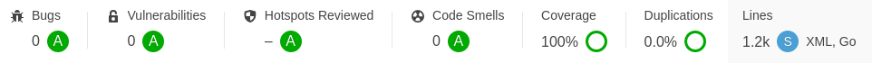

### Simple Go script to extract game names from XML gamelist files

#### It can be used with retro consoles based on EmulationStation as Recalbox and RetroPie. It reads the gamelist.xml files recursively, extract the game names and save it to a gamelist.txt file


#### Instructions:

1. The pre-compiled packages for RPI, Linux and Windows (not tested) can be found at `builds`

2. Usage: `getgamenames <path to roms file>` 

3. Example:

``` 
$ ./getgamenames test/roms/

 _____       _                _____              _
| __  | ___ | |_  ___  ___   |   __| ___  _____ |_| ___  ___
|    -|| -_||  _||  _|| . |  |  |  || .'||     || ||   || . |
|__|__||___||_|  |_|  |___|  |_____||__,||_|_|_||_||_|_||_  |
                                                        |___|

Starting game names extraction...
Done!!!
```

4. The `gamelist.txt` will be created in the same location


#### SonarQube Score



